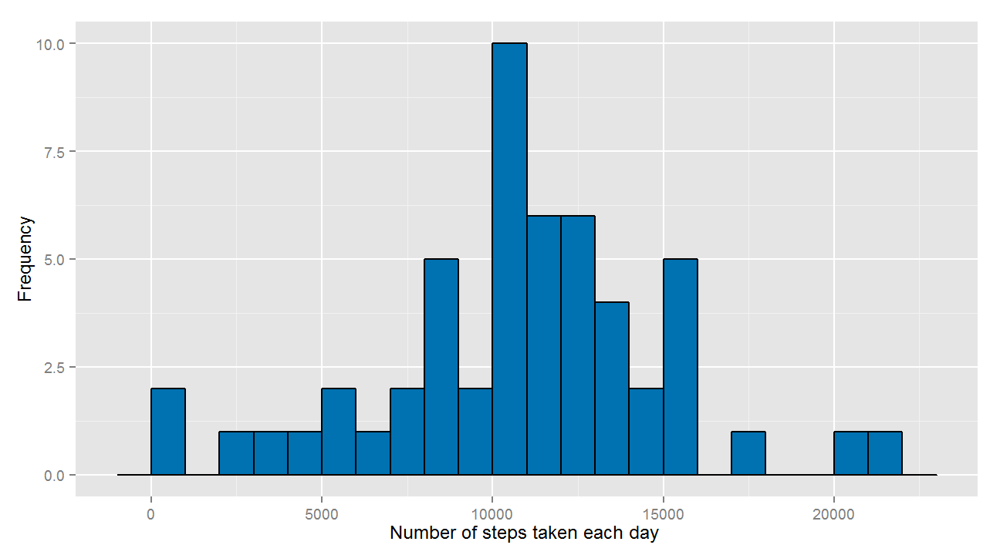
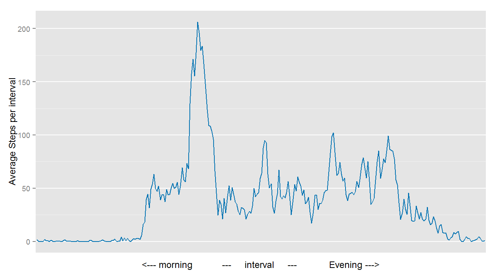

# Reproducible Research: Peer Assessment 1

By O. GUEYE

### Loading and preprocessing the data
*To run this code the working Directory should be the forked and cloned repository __"RepData_PeerAssessment1"__.*

1. Load the data (i.e. read.csv())

```r
if(!file.exists("./activity.csv")) {unzip ("./activity.zip") }
PA1 <- read.csv("./activity.csv")
```
  
  

2. Process/transform the data (if necessary) into a format suitable for your analysis

```r
PA1$date<-as.Date(PA1$date,"%Y-%m-%d")
PA1$interval<-as.factor(PA1$interval)
str (PA1)
```

```
## 'data.frame':	17568 obs. of  3 variables:
##  $ steps   : int  NA NA NA NA NA NA NA NA NA NA ...
##  $ date    : Date, format: "2012-10-01" "2012-10-01" ...
##  $ interval: Factor w/ 288 levels "0","5","10","15",..: 1 2 3 4 5 6 7 8 9 10 ...
```
  
  
    
### What is mean total number of steps taken per day?

Load of all the required packages & options

```r
require('dplyr')
require('ggplot2')
options(scipen = 1)
```


1. Calculate the total number of steps taken per day (as advised, the missing values will be ignored)

```r
sumPerDay <- aggregate(steps ~ date, data = PA1, FUN = sum)
head(sumPerDay)
```

```
##         date steps
## 1 2012-10-02   126
## 2 2012-10-03 11352
## 3 2012-10-04 12116
## 4 2012-10-05 13294
## 5 2012-10-06 15420
## 6 2012-10-07 11015
```


2. Make a **histogram** of the total number of steps taken each day  

<span style="color:blue">For a better reading of the histogram, I set the binwidth to 1000</span>

```r
ggplot(sumPerDay,aes(steps)) + 
        #define that it will be a histogram
         geom_histogram(fill="#0072B2", colour="black",binwidth=1000) +
        labs(x="Number of steps taken each day ",y= "Frequency", main = 'total number of steps taken each day')
```

 


**Just for info**, here is the corresponding barplot

```r
par(mfrow = c(1, 1), mar = c(3, 2, 2, 2))
ggplot(sumPerDay,aes(x=date, y=steps)) + 
        #define that it will be a barplot
         geom_bar(stat = "identity",fill="#0072B2", colour="black") +
        labs(x="Date",y= "Number of Steps per day", main='optional barplot  the about total number of steps taken each day') +
        theme(axis.text.x=element_blank())
```

 


3. Calculate and report the mean and median of the total number of steps taken per day

```r
MeanPerDay <- mean(sumPerDay$steps,na.rm=TRUE)
MedianPerDay <- median(sumPerDay$steps,na.rm=TRUE)
```
<span style="color:blue">**Mean =10766.1886792**</span>   
<span style="color:blue">**Median = 10765**</span>   


### What is the average daily activity pattern?
1. Make a time series plot (i.e. type = "l") of the 5-minute interval (x-axis) and the average number of steps taken, averaged across all days (y-axis)


```r
#Summarize the activity per interval
MeanPerInterval<- PA1 %>% 
        group_by(interval) %>%
        summarize(IntervalMean=mean(steps,na.rm='TRUE'))

#Plot Showing the average number of steps by interval.
par(mfrow = c(1, 1), mar = c(3, 2, 2, 2))
ggplot(MeanPerInterval,aes(x=interval, y=IntervalMean)) + 
        #define that it will be a line
         geom_line(aes(group =1),colour="#0072B2") +
        labs(x="interval",y= "Average Steps per interval", main= 'average number of steps taken across all day') +
        scale_x_discrete(breaks=NULL)
```

 

2. Which 5-minute interval, on average across all the days in the dataset, contains the maximum number of steps?

```r
Max <- MeanPerInterval[which.max(MeanPerInterval$IntervalMean),1]
```
<span style="color:blue">**835**</span>        
    
### Imputing missing values

1. Calculate and report the total number of missing values in the dataset (i.e. the total number of rows with NAs)


```r
missing_values <- sum(is.na(PA1$steps))
```
<span style="color:blue">**2304**</span>   

2. Devise a strategy for filling in all of the missing values in the dataset. The strategy does not need to be sophisticated. For example, you could use the mean/median for that day, or the mean for that 5-minute interval, etc.

<span style="color:blue"> My strategy is to replace the NA values in the steps variable by the mean calculated above for the same 5-minute  interval and round it to the ceiling value</span> 


3. Create a new dataset that is equal to the original dataset but with the missing data filled in.

```r
NewPA1 <- PA1
for (i in 1:nrow(NewPA1)) 
    {if (is.na(NewPA1[i,1]))
                 {  NewPA1[i,1] <- ceiling(MeanPerInterval[which(MeanPerInterval$interval == NewPA1[i,3]),2]) }
    }

head(NewPA1)
```

```
##   steps       date interval
## 1     2 2012-10-01        0
## 2     1 2012-10-01        5
## 3     1 2012-10-01       10
## 4     1 2012-10-01       15
## 5     1 2012-10-01       20
## 6     3 2012-10-01       25
```

4. Make a histogram of the total number of steps taken each day and Calculate and report the mean and median total number of steps taken per day. Do these values differ from the estimates from the first part of the assignment? What is the impact of imputing missing data on the estimates of the total daily number of steps?


```r
NewsumPerDay <- aggregate(steps ~ date, data = NewPA1, FUN = sum)

par(mfrow = c(1, 1), mar = c(3, 2, 2, 2))
ggplot(NewsumPerDay,aes(steps)) + 
        #define that it will be a histogram
         geom_histogram(fill="#0072B8", colour="black",binwidth=1000) +
        labs(x="Number of steps taken each day ",y= "Frequency", main ='total number of steps taken by day (after NAs replacement)')
```

 

```r
NewMeanPerDay <- mean(NewsumPerDay$steps)
NewMedianPerDay<- median(NewsumPerDay$steps)
```

<span style="color:blue">The new mean is **10784.9180328** while the mean with NA values was **10766.1886792 **</span>   
<span style="color:blue">The new median is **10909** while the median  with NA values was **10765 **</span>  


```r
mean_change_percentage <- round((NewMeanPerDay-MeanPerDay)*100/MeanPerDay,2)
mean_change_percentage <- round((NewMedianPerDay-MedianPerDay)*100/MedianPerDay,2)
```


<span style="color:blue">We can observe a **slight increase**  (**1.34%** for the mean  and **1.34%** for the median) . That is explained by the strategy choosen which consisted in adding the average value for the same interval. Hence,no impact can be considered regarding the mean of median value.</span>  


<span style="color:blue">However,by comparing the histograms, it appears that the frenquency for the 10000 to 11000 steps per day has increase by more than five numbers of days. </span>  

 
### Are there differences in activity patterns between weekdays and weekends?


1. Create a new factor variable in the dataset with two levels - "weekday" and "weekend" indicating whether a given date is a weekday or weekend day.  

<span style="color:blue">As no indication to which Dataset should be use, I decide to use the Dataset with no NAS created at the previous question. The new variable will be called **day_type**.<span style="color:blue">


```r
#ys.setlocale("LC_TIME", "en_US")
Sys.setlocale("LC_TIME", "English")
```

```
## [1] "English_United States.1252"
```

```r
wPA1 <- mutate (PA1,day_type = ifelse (weekdays(date) %in% c('Saturday', 'Sunday'),'weekend', 'weekday'))
table(wPA1$day_type)
```

```
## 
## weekday weekend 
##   12960    4608
```

2. Make a panel plot containing a time series plot (i.e. type = "l") of the 5-minute interval (x-axis) and the average number of steps taken, averaged across all weekday days or weekend days (y-axis). See the README file in the GitHub repository to see an example of what this plot should look like using simulated data.


```r
#Summarize the activity per interval
MeanPerdaytype<- wPA1 %>% 
        group_by(interval,day_type) %>%
        summarize(Mean=mean(steps,na.rm='TRUE'))

#Plot Showing the average number of steps by interval.
par(mfrow = c(1, 1), mar = c(3, 2, 2, 2))
ggplot(MeanPerdaytype,aes(x=interval, y=Mean, group=day_type)) + 
        #define that it will be a line
         geom_line(aes(colour= day_type)) +
        labs(x="interval",y= "Average Steps per interval") +
        scale_x_discrete(breaks=NULL)+
        geom_line(stat = "hline", yintercept = "mean", aes(colour = day_type))
```

 

<span style="color:blue">Instead of separating the data into two panels, I decided to display them together to be able to analyse more clearly their differences.  
I also added horizontale lines that represent the average number of stpes taken during a 5 minutes interval.  
The conclusion that can be made is that while the activity is clearly higher during the morning  and evening during the weekdays, it is more spread along the day in the weekends.  
Hence , the average activity is higher on the weekends as shown by the mean lines.</span>
