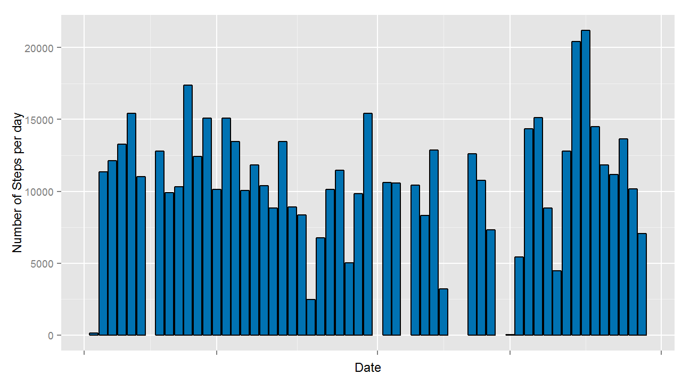

# Reproducible Research: Peer Assessment 1


### Loading and preprocessing the data
*To perform this code the working Directory should be the forked and cloned repository __"RepData_PeerAssessment1"__.*

>Load the data (i.e. read.csv())


```r
if(!file.exists("./activity.csv")) {unzip ("./activity.zip") }
PA1 <- read.csv("./activity.csv")
```


>Process/transform the data (if necessary) into a format suitable for your analysis

```r
PA1$date<-as.Date(PA1$date,"%Y-%m-%d")
PA1$interval<-as.factor(PA1$interval)
str (PA1)
```

```
## 'data.frame':	17568 obs. of  3 variables:
##  $ steps   : int  NA NA NA NA NA NA NA NA NA NA ...
##  $ date    : Date, format: "2012-10-01" "2012-10-01" ...
##  $ interval: Factor w/ 288 levels "0","5","10","15",..: 1 2 3 4 5 6 7 8 9 10 ...
```

    
### What is mean total number of steps taken per day?

> Load of all the required packages


```r
require('dplyr')
```

```
## Loading required package: dplyr
## 
## Attaching package: 'dplyr'
## 
## The following object is masked from 'package:stats':
## 
##     filter
## 
## The following objects are masked from 'package:base':
## 
##     intersect, setdiff, setequal, union
```

```r
require('ggplot2')
```

```
## Loading required package: ggplot2
```


> Calculate the total number of steps taken per day


```r
sumPerDay <- aggregate(steps ~ date, data = PA1, FUN = sum)
head(sumPerDay)
```

```
##         date steps
## 1 2012-10-02   126
## 2 2012-10-03 11352
## 3 2012-10-04 12116
## 4 2012-10-05 13294
## 5 2012-10-06 15420
## 6 2012-10-07 11015
```


> Make a **histogram** of the total number of steps taken each day  

I will make here a histogram (NOT A BARPLOT as this is what has been required in the assignment) of the total number of steps taken each day  

*for a better reading of the histogram, I set the binwidth to 1000*

```r
ggplot(sumPerDay,aes(steps)) + 
        #define that it will be a histogram
         geom_histogram(fill="#0072B2", colour="black",binwidth=1000) +
        labs(x="Number of steps taken each day ",y= "Frequency")
```

 


**Just for info**, here is the corresponding barplot

```r
par(mar=c(5,10,1,1),las = 1)
ggplot(sumPerDay,aes(x=date, y=steps)) + 
        #define that it will be a barplot
         geom_bar(stat = "identity",fill="#0072B2", colour="black") +
        labs(x="Date",y= "Number of Steps per day") +
        theme(axis.text.x=element_blank())
```

 


>Calculate and report the mean and median of the total number of steps taken per day


```r
MeanPerDay <- mean(sumPerDay$steps,na.rm=TRUE)
MedianPerDay <- median(sumPerDay$steps,na.rm=TRUE)
```
 
<span style="color:blue">**The mean total number of steps taken per day is _1.0767\times 10^{4}_ steps and the median is _10765_ steps.**</span>  


### What is the average daily activity pattern?
> Make a time series plot (i.e. type = "l") of the 5-minute interval (x-axis) and the average number of steps taken, averaged across all days (y-axis)


```r
#Summarize the activity per interval
MeanPerInterval<- PA1 %>% 
        group_by(interval) %>%
        summarize(IntervalMean=mean(steps,na.rm='TRUE'))

#Plot Showing the average number of steps by interval.
par(mar=c(5,10,1,1),las = 1)
ggplot(MeanPerInterval,aes(x=interval, y=IntervalMean)) + 
        #define that it will be a line
         geom_line(aes(group =1),colour="#0072B2") +
        labs(x="interval",y= "Average Steps per interval") +
        theme(axis.text.x=element_blank())
```

 

>Which 5-minute interval, on average across all the days in the dataset, contains the maximum number of steps?

```r
Max <- MeanPerInterval[which.max(MeanPerInterval$IntervalMean),1]
```


<span style="color:blue">**The  5-minute interval, on average across all the days in the dataset, contains the maximum number of steps is the _835_.**</span>            
    
### Imputing missing values

> Calculate and report the total number of missing values in the dataset (i.e. the total number of rows with NAs)


```r
Number_of_missing_values <- sum(is.na(PA1$steps))
```

<span style="color:blue">**There are  _2304_ missing values in the Activity Dataset.**</span> 

>Devise a strategy for filling in all of the missing values in the dataset. The strategy does not need to be sophisticated. For example, you could use the mean/median for that day, or the mean for that 5-minute interval, etc.

>Create a new dataset that is equal to the original dataset but with the missing data filled in.

>Make a histogram of the total number of steps taken each day and Calculate and report the mean and median total number of steps taken per day. Do these values differ from the estimates from the first part of the assignment? What is the impact of imputing missing data on the estimates of the total daily number of steps?

### Are there differences in activity patterns between weekdays and weekends?


>Create a new factor variable in the dataset with two levels - "weekday" and "weekend" indicating whether a given date is a weekday or weekend day.

>Make a panel plot containing a time series plot (i.e. type = "l") of the 5-minute interval (x-axis) and the average number of steps taken, averaged across all weekday days or weekend days (y-axis). See the README file in the GitHub repository to see an example of what this plot should look like using simulated data.
